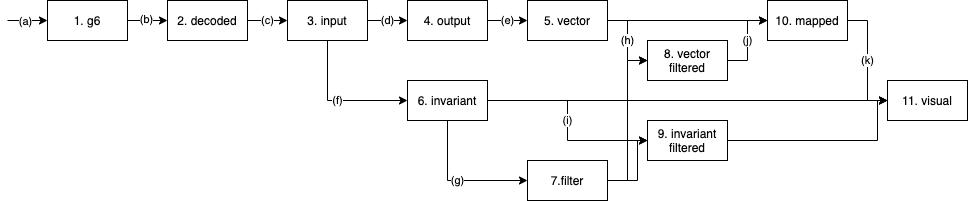

# tutte-polyn
Research on the Tutte polynomials.

# Prerequisite

```
pip3 install python-igraph plotly ipywidgets psutil kmapper
```

```
npm install plotlywidget
npm install -g electron@6.1.4 orca
```

Directories

```
mkdir bin data
cd data
mkdir 01_g6 02_decoded 03_input 04_output 05_vector 06_invariant 07_filter 08_vector_filtered 09_invariant_filtered 10_mapped 11_visual
```

# Workflow



## (a) Download graph data

http://users.cecs.anu.edu.au/~bdm/data/graphs.html

- Download the files for "Simple graphs: 4-10 vertices" to `data/01_g6`
- Extract `graph10.g6.gz` by `gunzip data/g6/graph10.g6.gz`

## (b) Docode g6 format

- Download **showg** program

http://users.cecs.anu.edu.au/~bdm/data/formats.html

- Download an executable for your environment.
- Place the file as `bin/showg`
- Set the execute permission to the file, if needed.

```
for i in {4..10}; do ./bin/showg ./data/01_g6/graph${i}.g6 ./data/02_decoded/graph${i}.txt; done
```

### (c) Create input for **tuttepoly** program


- Download and build **tuttepoly** program

https://homepages.ecs.vuw.ac.nz/~djp/tutte/#download

- Download the latest `tuttepoly-v*.*.*.tgz`.
- Move to `/tmp`
- Extract file by `tar zxf ~/Downloads/tuttepoly-v*.*.*.tgz`

```
cd /tmp/tuttepoly-v*.*.*/
./configure
make
```

- Copy program `/tmp/tuttepoly-v*.*.*/tutte/tutte` to `{this directory}/bin/`

```
for i in {4..10}; do ./scripts/conv_data.py ./data/02_decoded/graph${i}.txt > ./data/03_input/graph${i}.dat; done
```

### (d) Run **tuttepoly** program

Set the cache size 8 GB.

```
for i in {4..10}; do ./bin/tutte -c8G ./data/03_input/graph${i}.dat > ./data/04_output/graph${i}.out; done
```

### (e) Create vector data

```
for i in {4..10}; do ./scripts/vectorize.py -n $i ./data/04_output/graph${i}.out > ./data/05_vector/vector${i}.txt; done
```

- Convert vector data into CSV

```
for i in {4..10}; do ./scripts/vec_to_csv.py ./data/05_vector/vector${i}.txt > ./data/05_vector/vector${i}.csv; done
```

### (f) Compute Graph Invariants

```
mkdir data/inv
for t in num-edges cc conn cyclic girth triangle; do
    for i in {4..10}; do ./scripts/invariant.py -n $i -t $t ./data/03_input/graph$i.dat > ./data/06_invariant/graph$i.$t.csv; done
done
```

### (g) [Optional] Create filter definitions

- Example: filter connected graphs

```
for i in {2..9}; do ./scripts/create_filter.py -c conn ./data/06_invariant/graph$i.conn.csv > ./data/07_filter/graph${i}_conn.txt ; done
```

- Sample 1,000,000 connected graphs with n=10

```
./scripts/create_filter.py -c conn --sample 1000000 ./data/06_invariant/graph10.conn.csv > ./data/07_filter/graph10_conn_sample.txt
```

### (h) [Optional] Filter vector data

```
for i in {4..9}; do
    ./scripts/filter_sample.py ./data/05_vector/vector${i}.csv ./data/07_filter/graph${i}_conn.txt > ./data/08_vector_filtered/vector${i}_conn.csv
done
./scripts/run_filter.py ./data/05_vector/vector10.csv ./data/07_filter/graph10_conn_sample.txt > ./data/08_vector_filtered/vector10_conn_sample.csv
```

### (i) [Optional] Filter invariant data

```
for t in cc conn cyclic girth num-edges triangle; do
    for i in {4..9}; do
        ./scripts/filter_sample.py ./data/06_invariant/graph${i}.${t}.csv ./data/07_filter/graph${i}_conn.txt > ./data/09_invariant_filtered/graph${i}_conn.${t}.csv
    done
    ./scripts/run_filter.py ./data/06_invariant/graph10.${t}.csv ./data/07_filter/graph10_conn_sample.txt > ./data/09_invariant_filtered/graph10_conn_sample.${t}.csv
done
```

### (j) Run Kepler Mapper

- All instances up to n=9

```
for i in {4..9}; do ./scripts/run_mapper.py ./data/05_vector/vector${i}.csv > ./data/mapped/mapped${i}.json; done
```

- Connected graphs only

```
for i in {4..9}
    do ./scripts/run_mapper.py ./data/08_vector_filtered/vector${i}_conn.csv > ./data/10_mapped/mapped${i}_conn.json
done

./scripts/run_mapper.py ./data/08_vector_filtered/vector10_conn_sample.csv > ./data/10_mapped/mapped10_conn_sample.json
```

### (k) Visualize mapped graph

- All instances up to n=9

```
for t in cc conn cyclic girth num-edges triangle; do
    for i in {4..9}; do
        ./scripts/create_visual.py -t "n=${i} connected, color=${t}" \
        ./data/10_mapped/mapped${i}.json \
        ./data/06_invariant/graph${i}.${t}.csv \
        -o ./data/11_visual/graph${i}.${t}.png
    done
done
```

- Connected graphs only

```
for t in cc conn cyclic girth num-edges triangle; do
    for i in {4..9}; do
        ./scripts/create_visual.py -t "n=${i} connected, color=${t}" \
        ./data/10_mapped/mapped${i}_conn.json \
        ./data/09_invariant_filtered/graph${i}_conn.${t}.csv \
        -o ./data/11_visual/graph${i}_conn.${t}.png
    done
done


for t in cc conn cyclic girth num-edges triangle; do
    ./scripts/create_visual.py -t "n=10 connected sampled(1000000), color=${t}" \
    ./data/10_mapped/mapped10_conn_sample.json \
    ./data/09_invariant_filtered/graph10_conn_sample.${t}.csv \
    -o ./data/11_visual/graph10_conn.${t}.png
done
```

# References

- [Ball mapper: a shape summary for topological data analysis](https://arxiv.org/pdf/1901.07410.pdf)
